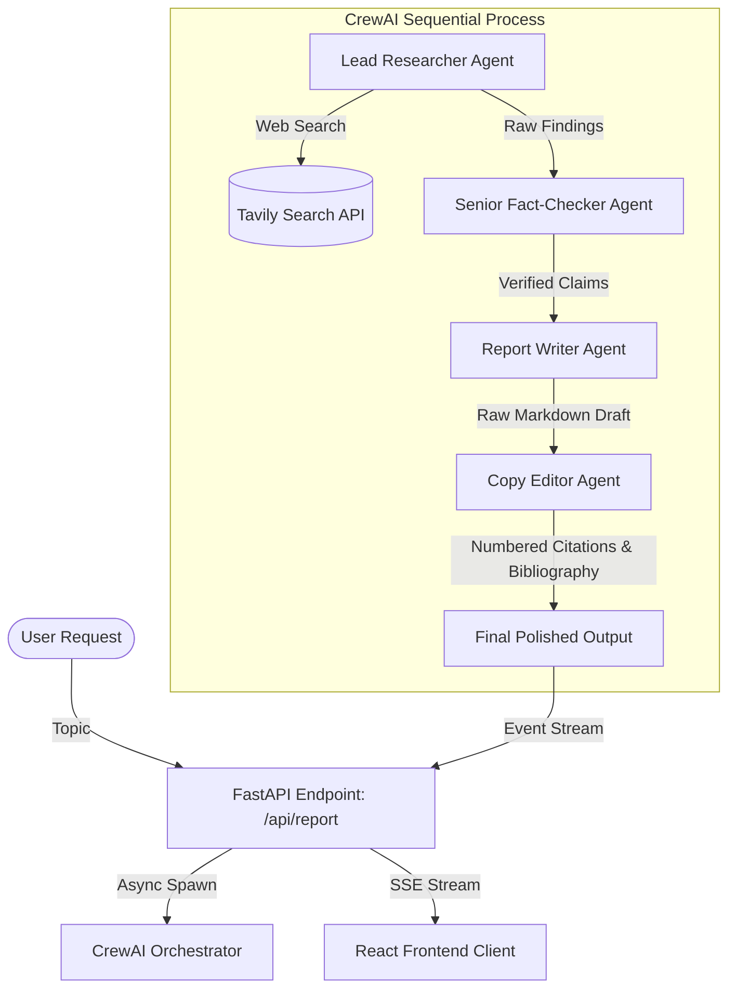

# Aurora Research Agent: Multi-Agent Research & Report Writer

An elegant, real-time multi-agent orchestrator that crawls the web, fact-checks findings, and drafts highly comprehensive, professionally cited markdown research reports. 

Featuring a premium **Glassmorphism · Aurora** React design on the frontend and an asynchronous **FastAPI + CrewAI** streaming architecture on the backend.

---

## 🏗️ System Architecture & Workflow



---

## 🤖 LLM Architecture & Fallback Mapping

To bypass upstream rate limits (429) and provider outages (404/500), each agent is assigned a primary model and a chain of failover backups. The custom `FallbackChatOpenAI` class manages this sequence automatically for both standard completions and real-time streams.

| Pipeline Task | Agent Role | Primary Model (Provider) | Backup Model 1 (Provider) | Backup Model 2 (Provider) | Special Configuration / Parameters |
| :--- | :--- | :--- | :--- | :--- | :--- |
| **1. Web Research** | Lead Researcher | `llama-3.3-70b-versatile` (Groq) | `llama-3.3-70b-instruct:free` (OpenRouter) | — | Capped at `max_iter=4` to allow 1-2 searches + final answer formatting. |
| **2. Fact-Checking** | Senior Fact-Checker | `nvidia/nemotron-3-ultra-550b-a55b:free` (OpenRouter) | `llama-3.3-70b-versatile` (Groq) | — | Capped at `max_iter=2`. Native OpenRouter Reasoning enabled (`extra_body={"reasoning": {"enabled": True}}`). |
| **3. Report Drafting** | Report Writer | `deepseek-ai/deepseek-v4-pro` (NVIDIA NIM) | `llama-3.1-70b-instruct:free` (OpenRouter) | `llama-3.3-70b-versatile` (Groq) | Capped at `max_iter=2`. NIM Chat Template settings configured (`extra_body={"chat_template_kwargs": {"thinking": False}}`). |
| **4. Copy Editing** | Copy Editor | `llama-3.3-70b-versatile` (Groq) | `llama-3.3-70b-instruct:free` (OpenRouter) | — | Capped at `max_iter=2`. Polishes and inserts inline references based on fact-checker claims. |

---

## ✨ Features

- **Sequential Agentic Orchestrator:** Runs four specialized agents (Researcher ➔ Fact-Checker ➔ Writer ➔ Editor) sequentially to guarantee deep topic exploration and professional reporting.
- **Real-Time SSE Event Streaming:** Streams agent status transitions, logs, and incremental document drafts live to the frontend using Server-Sent Events (SSE).
- **Multi-Provider Fallback Wrapper:** Resilient model routing via a custom `FallbackChatOpenAI` wrapper. If a primary provider (e.g., Groq) rate-limits (429) or is down (404), the query automatically fails over to backup models on OpenRouter or NVIDIA NIM.
- **NIM & OpenRouter Optimizations:** Integrates OpenRouter reasoning (extra body templates) and NVIDIA NIM's custom completion settings natively.
- **Token Usage Control:** Hard caps agent iterations (`max_iter`) to prevent runaway thinking loops and limit API billing costs.
- **SlowAPI Rate Limiting:** Backend protected by per-IP rate limiters (5 requests/min) to prevent spam.
- **Glassmorphism UI:** A modern visual interface styled with gold highlights, smooth micro-animations, and a drifting ambient aurora background.

---

## 🛠️ Tech Stack

### Backend
- **Core:** Python 3.10+, FastAPI
- **Agent Framework:** CrewAI v0.36.0, LangChain
- **Search Engine:** Tavily API
- **Rate Limiting:** SlowAPI

### Frontend
- **Core:** React, Vite, TypeScript
- **Styling:** Tailwind CSS v4
- **Markdown Rendering:** `react-markdown`, `remark-gfm`

---

## 🚀 Getting Started

### Prerequisites
- Python 3.10 or higher
- Node.js 18 or higher
- NPM

### 1. Clone & Set Up Environment
Copy the example environment file in the backend directory:
```bash
cd backend
cp .env.example .env
```
Open `backend/.env` and insert your credentials:
```env
GROQ_API_KEY=your_groq_key
OPENROUTER_API_KEY=your_openrouter_key
NIM_API_KEY=your_nvidia_nim_key
TAVILY_API_KEY=your_tavily_key
```

### 2. Run the FastAPI Backend
Create a virtual environment, install dependencies, and start the development server:
```bash
cd backend
python3 -m venv .venv
source .venv/bin/activate
pip install -r requirements.txt
python -m uvicorn app.main:app --host 0.0.0.0 --port 8000 --reload
```
The Swagger documentation will be available at [http://localhost:8000/docs](http://localhost:8000/docs).

### 3. Run the React Frontend
Open a new terminal window, install npm packages, and boot the Vite server:
```bash
cd frontend
npm install
npm run dev
```
Open your browser and navigate to [http://localhost:5173/](http://localhost:5173/).

---

## 📂 Project Structure

```
├── backend
│   ├── app
│   │   ├── agents          # Agent role prompts and fallback configurations
│   │   ├── routers         # SSE stream routes and CORS endpoints
│   │   ├── tools           # Tavily web-search wrapping logic
│   │   ├── config.py       # Pydantic Settings loaders
│   │   ├── crew.py         # Orchestrator sequential setup
│   │   ├── events.py       # EventBus publisher/subscriber
│   │   ├── main.py         # FastAPI bootstrapper
│   │   └── schemas.py      # Request validation schemas
│   ├── requirements.txt
│   └── .env
└── frontend
    ├── src
    │   ├── components      # AuroraBackground, GlassCard, AgentPipeline
    │   ├── styles          # Tailwind Globals & Design Tokens
    │   ├── hooks           # useReportStream hook
    │   ├── App.tsx         # Main UI Coordinator
    │   └── types.ts        # SSE Types
    ├── package.json
    └── tailwind.config.js
```
